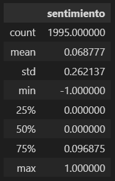
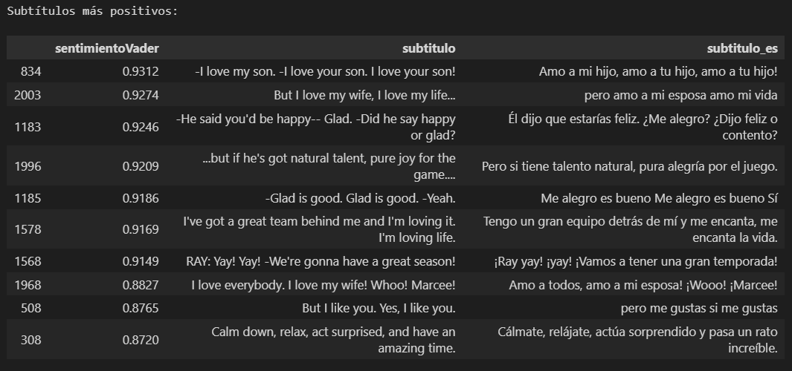
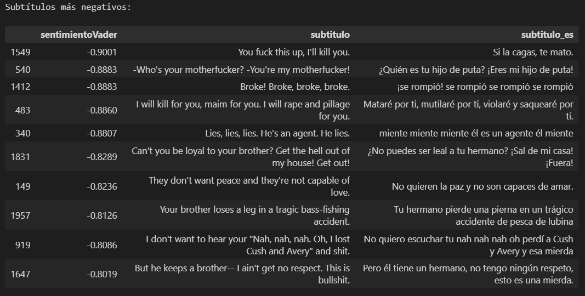
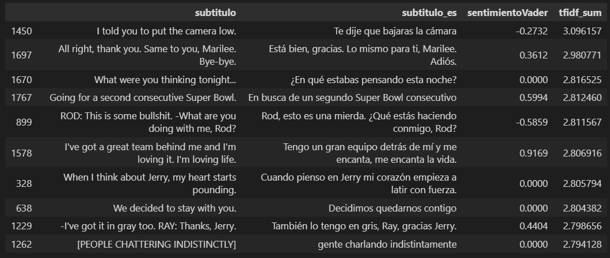
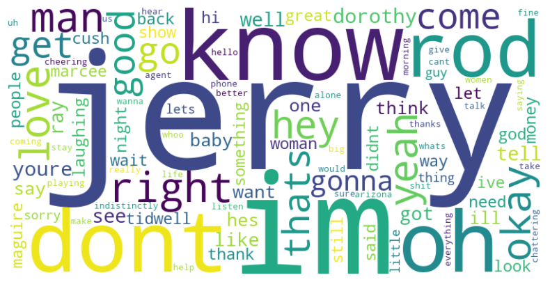

# Deep Learning aplicado a un guión de película
**Autor: Jorge Aguirre**


Se utiliza el guión (en idioma original) de la película: Jerry Maguire - 1996

- Se realiza la importación del archivo de subtítulos csv.

### Instalar:
Es necesario instalar algunas librerías para poder ejecutar éste notebook aparte de las clásicas como pandas.

```python
pip install spacy

python -m spacy download en_core_web_sm

pip install textblob

python -m textblob.download_corpora

pip install wordcloud matplotlib

pip install google-cloud-translate

```
### Puntos Tratados en el desarrollo. ###
El siguiente esquema sirve de mapa de los campos y tratamientos principales:


## NLP

Se tratan los siguientes puntos:
### Limpieza
Utilizo dos funciones distintas según los resultados obtenidos que permiten compararlos
### Tokenización
Genero la columna 'tokens' para representarlos.
### Eliminación de Stopwords
Genero columna 'tokensSinStopwords'
### Lematización
Aplico lematización para generar una nueva columna: 'tokensLematizados'.

## Análisis de Sentimiento
### TextBlob
Genero una nueva columna 'sentimiento' a través de la evaluación mediante TextBlob.

- Utilizando un servicio de Google Cloud, genero campo 'subtitulo_es' para mejor interpretación de futuros resultados.

Me parece satisfactorio el análisis de sentimiento, en especial al compararlo con la versión anterior.



### Análisis de Sentimiento con VADER
Buscando otro método que quizás me realice una mejor clasificación de sentimientos es que voy a probar VADER.


Parece capturar mejor el sentimiento dentro de los subtítulos.

#### Top de Positivos y Negativos
Subtítulos más positivos:


Subtítulos más negativos:


La respuesta del modelo me parece satisfactoria.

### Análisis con TF-IDF vectorizer
Se generan diversas columnas con palabras separadas por espacios a partir de los subtítulos.
Tomo el 'subtitulolimpio3' para realizar el presente análisis por tener los procesos adecuados:
- Sin stopwords
- en minúsculas

Se pueden obtener las:
Palabras más relevantes:


Podemos ver los subtítulos con mayor incidencia tfidf de sus palabras.


### Gráfica 1:
Veamos la frecuencia con que aparecen los subtítulos según su **'tfidf_sum'**, que es la suma de TF-IDF para el subtítulo evaluado.


Podemos separar subtítulos en rangos de TF-IDF y observar algunos para entender como se plasma esa diferencia en el índice. Lo siguiente es una muestra de algunos elementos de subtitulos altos:


Mi interpretación es que un alto TF-IDF resulta para subtítulos con gran valor de contenido impactante. Son como fraces que podemos recordar y asociar a la película. Lo siguiente es una muestra de algunos elementos de subtitulos bajos:


Para un bajo TF-IDF es todo lo contrario, en general son fraces menos impactantes.

### Gráfica 2:
En el siguiente gráfico se representa el eje x coincidente con el gráfico anterior pero en el se plasma la evaluación de sentimientos resultante.
De ésta manera se puede tener una visión general de como se distribuye el sentimiento en toda la película.


### Nube de Palabras
A partir de los subtítulos se puede generar la nube de palabras.

