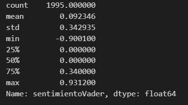
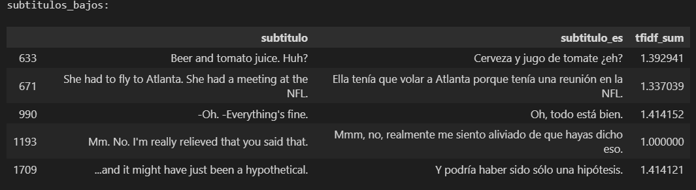

# Deep Learning aplicado a un guión de película
**Autor: Jorge Aguirre**

Se utiliza el guión de la película: Jerry Maguire - 1996

- Se realiza la importación del archivo de subtítulos csv.

### Instalar:
Es necesario instalar algunas librerías para poder ejecutar éste notebook aparte de las clásicas como pandas.

```python
pip install spacy

# Según el paquete usado: es_core_news_sm, es_core_news_md, es_core_news_lg
python -m spacy download es_core_news_sm

pip install textblob

python -m textblob.download_corpora

pip install wordcloud matplotlib

```
### Puntos Tratados en el desarrollo. ###
## NLP

Se tratan los siguientes puntos:
### Limpieza
Utilizo dos funciones distintas según los resultados obtenidos que permiten compararlos
### Tokenización
Genero la columna 'tokens' para representarlos.
### Eliminación de Stopwords
Genero columna 'tokensSinStopwords'
### Lematización
Aplico lematización para generar una nueva columna: 'tokensLematizados'.
>Se observa un problema con los sustantivos propios como los nombres de ciudades: 'Dallas' termina lematizado como 'dalla' y se debe considerar en algún analisis posterior.

## Análisis de Sentimiento
### TextBlob
Genero una nueva columna 'sentimiento' a través de la evaluación mediante TextBlob.
Me parece demasiado neutral el análisis de sentimiento.


### Sentimiento TextBlob por Sentence
Genero columna 'sentimientoSentence' de cada subtítulo como promedio de la evaluación de cada Oración.


Sigue teniendo peso el sentimiento neutral.

### Análisis de Sentimiento con VADER
Buscando otro método que quizás me realice una mejor clasificación de sentimientos es que voy a probar VADER.



Parece capturar mejor el sentimiento dentro de los subtítulos.

#### Top de Positivos y Negativos
Subtítulos más positivos:


Subtítulos más negativos:


- Sin barreras, sin fronteras. - Vale Chad, ya lo entiendo
  - No creo que sea algo negativo
- No me gusta ver películas sin ti.
  - Aquí el algoritmo se centra en 'No me gusta' en ves de considerar la frase completa.
- Hola. - Cuánto tiempo sin verte.
  - Realmente no es negativa

### Análisis con TF-IDF vectorizer
Se generan diversas columnas con palabras separadas por espacios a partir de los subtítulos.
Tomo el 'subtitulolimpio3' para realizar el presente análisis por tener los procesos adecuados:
- Sin stopwords
- en minúsculas

Se pueden obtener las:
Palabras más relevantes:
|palabra   |relevancia|
|-         |-|
|jerry     | 0.021226|
|bien      |0.019276|
|quiero    | 0.018839|
|gracias   | 0.014444|
|hola      | 0.011665|
|quieres   | 0.011499|
|si        | 0.011457|
|rod       | 0.011077|
|vamos     | 0.010827|
|voy       | 0.010753|

Podemos ver los subtítulos con mayor incidencia tfidf de sus palabras.


### Gráfica 1:
Veamos la frecuencia con que aparecen los subtítulos según su 'tfidf_sum', que es la suma de TF-IDF para el subtítulo evaluado.


Podemos separar subtítulos en rangos de TF-IDF y observar algunos para entender como se plasma esa diferencia en el índice.


Mi interpretación es que un alto TF-IDF resulta para subtítulos con gran valor de contenido impactante. Son como fraces que podemos recordar y asociar a la película.



Para un bajo TF-IDF es todo lo contrario, en general son fraces menos impactantes.

### Gráfica 2:
En el siguiente gráfico se representa el eje x coincidente con el gráfico anterior pero en el se plasma la evaluación de sentimientos resultante.
De ésta manera se puede tener una visión general de como se distribuye el sentimiento en toda la película.


### Nube de Palabras
A partir de los subtítulos se puede generar la nube de palabras.

